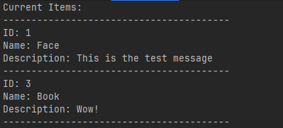

# GrpcKafkaSolution

Этот проект демонстрирует взаимодействие между тремя .NET-приложениями:

1. **gRPC-сервер (Backend)** – принимает запросы от клиента и отправляет сообщения в Kafka.
2. **gRPC-клиент (Client)** – отправляет команды `Add`, `Update`, `Delete` на сервер.
3. **Kafka Consumer** – подписывается на топик и обрабатывает события с задержкой, храня данные в памяти.

## Скриншоты с работой приложений:

### gRPC-client

Клиент отправляет Add, Update, Delete команды

### Kafka Consumer

Kafka Consumer обрабатывает сообщения и выводит текущие элементы

